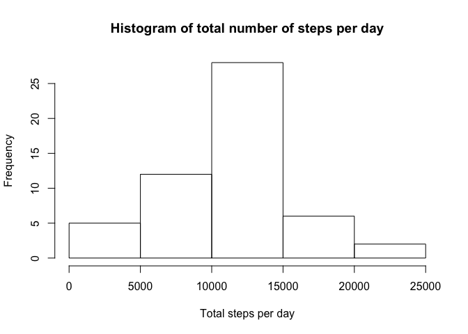
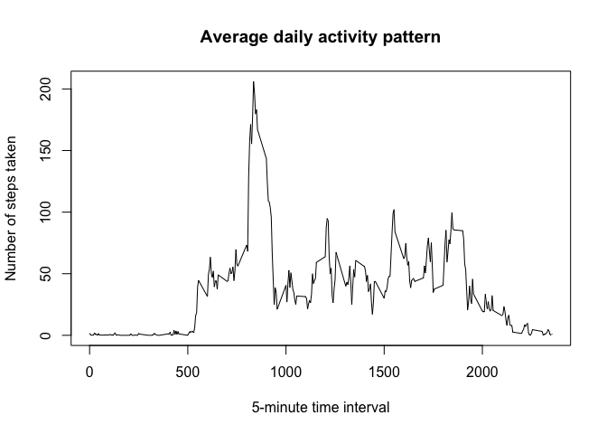
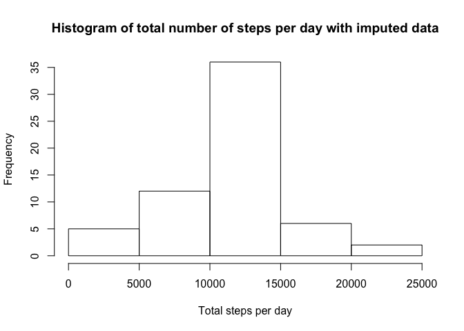
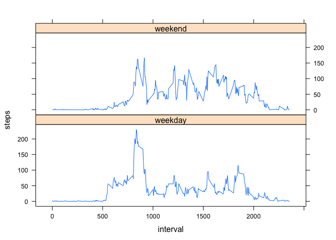

# Reproducible Research: Peer Assessment 1


## Loading and preprocessing the data
Read in the dataset of steps taken by a person for 2 months, measured in 5 minute intervals.  
The dataset is stored in activity.zip included in this repository.  

```r
unzip("activity.zip")
activity <- read.csv("activity.csv")
str(activity)
```

```
## 'data.frame':	17568 obs. of  3 variables:
##  $ steps   : int  NA NA NA NA NA NA NA NA NA NA ...
##  $ date    : Factor w/ 61 levels "2012-10-01","2012-10-02",..: 1 1 1 1 1 1 1 1 1 1 ...
##  $ interval: int  0 5 10 15 20 25 30 35 40 45 ...
```
The variables included in this dataset are:

* **steps**: Number of steps taking in a 5-minute interval (missing
    values are coded as `NA`)

* **date**: The date on which the measurement was taken in YYYY-MM-DD
    format

* **interval**: Identifier for the 5-minute interval in which
    measurement was taken, the last two digits mean the minutes of the hour
    the first digits the hour, so 2355 means the interval from 23:55 to 24:00 hour.
    
## What is mean total number of steps taken per day?
To calculate the total number of steps taken per day we make a dataset where the steps are summarised
over the different dates. The missing values are ignored for the moment.  

```r
StepsPerDay <- aggregate(steps ~ date, data=activity, sum)
str(StepsPerDay)
```

```
## 'data.frame':	53 obs. of  2 variables:
##  $ date : Factor w/ 61 levels "2012-10-01","2012-10-02",..: 2 3 4 5 6 7 9 10 11 12 ...
##  $ steps: int  126 11352 12116 13294 15420 11015 12811 9900 10304 17382 ...
```
Then we make it visible with a histogram of the total number of steps taken each day.  

```r
hist(StepsPerDay$steps, 
     main = "Histogram of total number of steps per day",
     xlab = "Total steps per day")
```

<!-- -->

Finally we calculate and report the mean and median of the total number of steps taken each day. 

```r
mean(StepsPerDay$steps, na.rm=TRUE)
```

```
## [1] 10766.19
```

```r
median(StepsPerDay$steps, na.rm=TRUE)
```

```
## [1] 10765
```


So the mean 1.0766189\times 10^{4} and the median 10765 are quite close together.  

## What is the average daily activity pattern?
To see what is the avarage daily pattern we first have to calculate the average 
per time interval over all the days in the dataset.

```r
StepsPerInterval <- aggregate(steps ~ interval, data = activity, mean, na.rm=TRUE)
str(StepsPerInterval)
```

```
## 'data.frame':	288 obs. of  2 variables:
##  $ interval: int  0 5 10 15 20 25 30 35 40 45 ...
##  $ steps   : num  1.717 0.3396 0.1321 0.1509 0.0755 ...
```
Which we can now show in a nice plot.

```r
plot(StepsPerInterval$interval, StepsPerInterval$steps, type = "l",
     main = "Average daily activity pattern",
     xlab = "5-minute time interval",
     ylab = "Number of steps taken")
```

<!-- -->

It seems our test subject does some daily excersise somewhere between the 5:00 and 10:00 a.m.  
Which 5-minute interval contains the maximum numbers of steps?

```r
StepsPerInterval[StepsPerInterval$steps == max(StepsPerInterval$steps), ]
```

```
##     interval    steps
## 104      835 206.1698
```
It seem the test subject is on average taking the most steps around 8:35 am.  

## Imputing missing values
Perhaps we have introduced some bias in this research by ignoring the missing values which are in the dataset activity.

```r
head(activity)
```

```
##   steps       date interval
## 1    NA 2012-10-01        0
## 2    NA 2012-10-01        5
## 3    NA 2012-10-01       10
## 4    NA 2012-10-01       15
## 5    NA 2012-10-01       20
## 6    NA 2012-10-01       25
```

Let's see how many missing values there are in the dataset **activity**.

```r
missing <- sum(!complete.cases(activity))
total <- nrow(activity)
percentage <- round(missing/total*100, digits = 1)
```
That is 2304 missing values on 17568 observations, which is 13.1 %.  
That is quite large, so let's see what happens when we impute the data.  
First select the complete and incomplete cases.
From the incomplete cases we drop the first column since there are only NA's in it.

```r
complete <- activity[complete.cases(activity),]
incomplete <- activity[!complete.cases(activity),][-c(1)]
head(complete)
```

```
##     steps       date interval
## 289     0 2012-10-02        0
## 290     0 2012-10-02        5
## 291     0 2012-10-02       10
## 292     0 2012-10-02       15
## 293     0 2012-10-02       20
## 294     0 2012-10-02       25
```

```r
head(incomplete)
```

```
##         date interval
## 1 2012-10-01        0
## 2 2012-10-01        5
## 3 2012-10-01       10
## 4 2012-10-01       15
## 5 2012-10-01       20
## 6 2012-10-01       25
```

Then we use the **StepsPerInterval** dataset with the mean value per interval
to give a (mean) value to the incomplete cases.

```r
completed <- merge(incomplete, StepsPerInterval, by = "interval")
head(completed)
```

```
##   interval       date    steps
## 1        0 2012-10-01 1.716981
## 2        0 2012-11-30 1.716981
## 3        0 2012-11-04 1.716981
## 4        0 2012-11-09 1.716981
## 5        0 2012-11-14 1.716981
## 6        0 2012-11-10 1.716981
```
Finally we create a new dataset **activityImputed** which contains mean 
values for the missing data. Since the order of the data is altered 
by the merge and the pasting together of the data, we sort the final
dataset again in the original order of **activity**.

```r
activityImputed <- rbind(complete, completed)
activityImputed <- activityImputed[order(activityImputed$date,activityImputed$interval),]
head(activityImputed)
```

```
##        steps       date interval
## 1  1.7169811 2012-10-01        0
## 10 0.3396226 2012-10-01        5
## 17 0.1320755 2012-10-01       10
## 29 0.1509434 2012-10-01       15
## 33 0.0754717 2012-10-01       20
## 45 2.0943396 2012-10-01       25
```
Now we can analyse this imputed dataset and see if there is any difference.  
First calculate the total number of steps taken per day, then make a histogram of it.  

```r
StepsPerDayImp <- aggregate(steps ~ date, data = activityImputed, sum)
hist(StepsPerDayImp$steps,
     main = "Histogram of total number of steps per day with imputed data",
     xlab = "Total steps per day")
```

<!-- -->

The original mean of the total steps taken per day was 1.0766189\times 10^{4}.
The mean of the imputed data is:

```r
mean(StepsPerDayImp$steps, na.rm=TRUE)
```

```
## [1] 10766.19
```
Because we imputed the data with the mean value, the mean value will not alter.  

The original median of the total steps taken per day was 10765. The median of the imputed data is:

```r
median(StepsPerDayImp$steps, na.rm=TRUE)
```

```
## [1] 10766.19
```
Because we added values the median will move to the mean value.  
This also shows in the histogram. The frequency of the interval where the mean value is, is higher.  

## Are there differences in activity patterns between weekdays and weekends?
Perhaps there is different behaviour in the weekend than on workdays.  
To investigate that we need to create a new factor variable in the 
dataset **activityImputed** with two levels: "weekend" and "weekday". 
(Because my dutch locale can not be changed it says "zaterdag" for "Saturday" and "zondag" for "Sunday")

```r
day <- weekdays(as.Date(activityImputed$date))
day[day %in% c("zaterdag","zondag")] <- "weekend"
day[!(day %in% c("weekend"))] <- "weekday"
factor(day)
activityImputed <- cbind(activityImputed,day)
```

```r
head(activityImputed)
```

```
##        steps       date interval     day
## 1  1.7169811 2012-10-01        0 weekday
## 10 0.3396226 2012-10-01        5 weekday
## 17 0.1320755 2012-10-01       10 weekday
## 29 0.1509434 2012-10-01       15 weekday
## 33 0.0754717 2012-10-01       20 weekday
## 45 2.0943396 2012-10-01       25 weekday
```
Then we calculate the average steps per time interval again, but now also per type of day.

```r
StepsPerIntervalImp <- aggregate(steps ~ interval+day, data = activityImputed, mean)
head(StepsPerIntervalImp)
```

```
##   interval     day      steps
## 1        0 weekday 2.25115304
## 2        5 weekday 0.44528302
## 3       10 weekday 0.17316562
## 4       15 weekday 0.19790356
## 5       20 weekday 0.09895178
## 6       25 weekday 1.59035639
```

```r
tail(StepsPerIntervalImp)
```

```
##     interval     day       steps
## 571     2330 weekend  1.38797170
## 572     2335 weekend 11.58726415
## 573     2340 weekend  6.28773585
## 574     2345 weekend  1.70518868
## 575     2350 weekend  0.02830189
## 576     2355 weekend  0.13443396
```

```r
str(StepsPerIntervalImp)
```

```
## 'data.frame':	576 obs. of  3 variables:
##  $ interval: int  0 5 10 15 20 25 30 35 40 45 ...
##  $ day     : Factor w/ 2 levels "weekday","weekend": 1 1 1 1 1 1 1 1 1 1 ...
##  $ steps   : num  2.251 0.445 0.173 0.198 0.099 ...
```
So the daily patterns change a little in weekends as compaired to weekdays as can be seen in this plot.

```r
lattice::xyplot(steps ~ interval | day, data = StepsPerIntervalImp, layout = c(1,2), type="l")
```

<!-- -->

In weekends the testsubject moves a little less between 5:00 and 10:00 and a little more and longer for the rest of the day.
